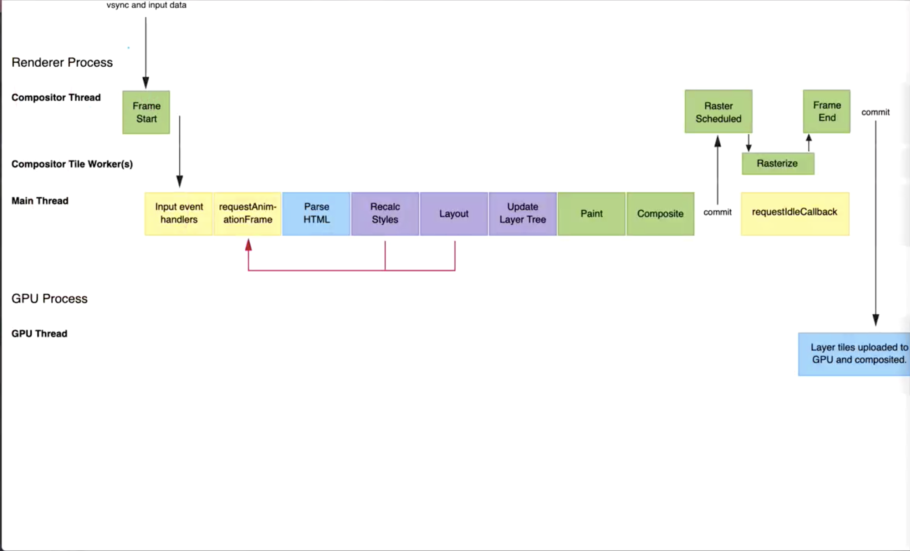

### React与Vue的差异

#### 开发时

react：js中可以写html标签

vue：js和html是独立的

#### 编译时

React：只是处理了标签，将标签编译成了js方法，所以react没有**编译时优化**，但是有**运行时优化**

Vue：做了**编译时优化**所以需要按照一定的规范（主要是template部分），不能混合书写js和html

##### vue2编译时优化

> 在线编译：运行时编译
>
> 离线编译

dom也是js对象，虚拟dom是dom的简化（render函数生成虚拟dom ）

createCompilerCreator（编译模版的函数）compileToFunctions(template)

1. html ===> AST（抽象语法树），分析出每个标签的AST，根据栈结构进行拼接

2. optimize（优化）

   标记静态节点（优化虚拟dom  diff）AST中的静态标记`static` 

   静态节点创建提升（优化虚拟dom创建，不重复创建虚拟dom），虚拟dom的静态标记`__static__`

3. generator

#### 运行时

**vue2运行时优化**

双向数据绑定===>Object.defineProperty()，render时收集依赖，数据修改时触发set，触发render重新获取数据

vue1时一个动态数据就会对应一个watcher，运行时性能差，所以vue1时也没有dom diff

vue2时一个组件对应一个watcher，所以需要dom diff，并且是在组件层面，所以vue的组件应该更加的颗粒化

总结： 将数据定向到数组，在组件层面进行dom diff，利用了编译时的`__static__`的静态节点提升优化了虚拟dom的创建

##### react的运行时优化

浏览器架构

**渲染进程**：

编排线程：作用1启动主线程，2接受输入有事件通知主线程事件类型，3没有事件时直接通知GPU提交绘图

主线程：js就是基于主线程，

一帧的渲染过程：编排线程通知主线程后会触发requestAnimationFrame事件（在上一帧注册，在一帧最开始时执行，因为一般可能会有对动画对视图的交互，生成对当前一帧的影响），在ParseHTML（会生成dom树）阶段遇到js时会让V8引擎执行js，会阻塞主线程，RecaicStyles（生成css树），Layout（渲染树），Update。Paint处理层级，栅格化，分图块（transform在这里，所以不会重排重绘），requestIdleCallback

performance

**GPU进程**

由于不是组件单位的diff，会一直递归阻塞渲染，所以需要将整个diff任务拆分成多个任务（fiber）使他不会阻塞进程（协程：在语言层面控制程序的中断和继续），最后统一更新

1. 调度：选择优先级高的插队的任务，scheduler

2. 协调：计算出要执行的任务（计算当前帧是否有时间执行），执行任务，reconciler

3. 提交：根据协调提交的内容同步修改，render

#### vite

相当于webpack，打包工具

1. 开启server
2. type="module"（浏览器支持），以es module的形式加载main.js
3. 请求main.js，分析js，替换node_module，切换绝对路径，增加标识（css等），返回main，客户端支持的代码client（初始化，和开发的服务端建立socket热更新）
4. 遇到import，请求资源，node拦截请求，分析路由，处理资源（vue，css等）返回资源